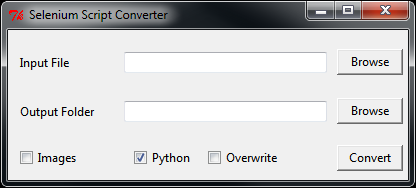

================
Selenium Wrapper
================

Selenium Wrapper is a project designed to make 
`WebDriver <http://docs.seleniumhq.org/projects/webdriver/>`_-based 
`Selenium <http://docs.seleniumhq.org/>`_  more feasible for load testing. Using 
`PhantomJS <http://phantomjs.org/>`_ and `GhostDriver <https://github.com/detro/ghostdriver>`_, 
it can spawn off as many child processes running provided test suites as your processor can 
handle. These test suites are optimized for sites becoming slow and not responding, and 
wait for elements to appear with minimal CPU usage (unlike native WebDriver). Unlike 
stock Selenium, this wrapper also offers logging capabilities, automatic screenshots, and
launching arbitrary numbers of tests running simultaneously from one window. 

***************
Project Outline
***************

Selenium Wrapper is composed of two related components. The first component used and seen is 
the converter. The converter is used to take a 
`Selenium IDE <http://docs.seleniumhq.org/docs/02_selenium_ide.jsp>`_-exported Python
WebDriver script and convert it for usage with the wrapper, the second component. The wrapper
is as described above, a framework making load testing possible with Selenium. The converter 
creates a folder which contains the wrapped script and can be transported between any number of 
computers. 

************
Installation
************

When initializing a brand new installation and not having a prepackaged converter, first checkout
the repository::

  git clone https://github.com/brhoades/selenium_wrapper.git

^^^^^^^^^^^^^^^
Converter Setup
^^^^^^^^^^^^^^^

Install `Ruby <https://www.ruby-lang.org/en/>`_ and then the appropriate
`ActiveTCL <http://www.activestate.com/activetcl/downloads>`_ library for your version.
After installing, navigate to the directory cloned into and run::

  bundle install

This will install the Ruby gems required for the converter to function.

^^^^^^^^^^^^^
Wrapper Setup
^^^^^^^^^^^^^

Prepare a python installation for the converter program. Python 2.7.8 is the supported 
Python version. Now `install Python <https://www.python.org/download/releases/2.7.8/>`_ 
for the correct platform. 

Use `pip <https://pip.pypa.io/en/latest/installing.html>`_ to install 
`Selenium <https://pypi.python.org/pypi/selenium>`_:: 

  pip install selenium

Also install the latest version of `PhantomJS <http://phantomjs.org/download.html>`_ for your 
platform.

Currently a distributed setup where a separate install of Python is shipped with each script
is only possible for Windows. For other operating systems, there will need to be a system wide
installation on every machine participating. For these other operating systems ensure that the
"Python" option is unchecked on the converter.

"""""""""""""
Windows Setup
"""""""""""""

Perform an installation of `Python <https://www.python.org/download/releases/2.7.8/>`_ 
into the default folder. The fewer modules that are included, the better. 
Excluding lib-tk, documentation, and testing suites will streamline things. 
This folder will later be copied to the correct spot.

Install `pip <https://pip.pypa.io/en/latest/installing.html>`_ into your Python installation
and now install the module for `Selenium <https://pypi.python.org/pypi/selenium>`_::

  pip install selenium

Now install the `curses extension package <http://www.lfd.uci.edu/~gohlke/pythonlibs/#curses>`_.

Afterwards copy/move the Python folder that was just created to ``conversion_utils/python27``. 
Extract the ``phantomjs-release.zip`` for Windows and put the binary within the ``python27`` folder as well.

Now run the conversion program::

  ruby main.rb

^^^^^^^^^^^^^^^^^^^^^^
Converter Distribution
^^^^^^^^^^^^^^^^^^^^^^

To ease other's usage of the converter, consider packaging it into an exe using 
`OCRA <https://github.com/larsch/ocra>`_. The following will install the gem and run the compiler::

  gem install ocra
  ocra_compile.bat

This will automatically generate a portable version of the converter in an exe.

================
Script Converter
================

*****
Usage
*****

The converter ``main.rb`` or ``selenium_convert.exe`` will launch after about 15 seconds 
(results may vary). This converter has the files necessary to create a portable Python 
installation with Selenium and PhantomJS. 

Browsing to a file will automatically choose a directory with the matching name to output to in 
``out/``. If the file is properly exported from selenium, it will be converted into a wrapped 
script. There are several options which will augment the way the wrapper runs. 

- Images (*off*) will enable loading images in the headless browser.
- Python (*on*) will copy the included python installation to the output directory.
- Overwrite (*off*) will overwrite the output directory without prompting.

After selecting your input Python file and (optionally) your output folder, hit convert.

Conversion will take a while. It will initialize a new directory, copy a slimmed down Python 
install into it, and then convert the script into a form which utilizes the included Selenium 
wrapper. Once finished, it will prompt you to tell you so. Progress can be monitored in the 
black terminal that opened when the exe/script was initially ran.

Conversion will automatically strip any assertions or clears from the script provided. 
Assertions are not currently supported as the wrapper does not currently wrap itself in a 
unit testing suite. Any ``driver.find_element_by(...).send_keys( "text" )`` is wrapped 
into a :py:func:`sw.utils.sendKeys` function. This eliminates the need for a .clear( ) 
statement and saves time. Conversion also replaces any ``find_element_by_`` segments with 
:py:func:`sw.utils.sleepwait` which is a controlled (and CPU-optimized) function to wait for an 
element.

**********
Directives
**********

There are directives which may be inserted into the source script's function which will be 
parsed by the converter into wrapper functions. Variables can be used in their arguments 
as the converter turns the directives into functions after conversion.

Available Directives:
  - ``#log message``

    - This will write to our child's log "message". Directly calls :py:func:`sw.child.logMsg`
  - ``#msg message``

    - Writes "Child #: message" to the console. Calls :py:func:`sw.child.msg`
  - ``#wait element kwargs``

    - This calls :py:func:`sw.utils.waitToDisappear` and takes any of the kwargs as the second argument. 
      Please reference that function for further details about its arguments and other options.
    - ``#wait overlay type=id``

      - Waits for the element with id=overlay to disappear
    - ``#wait overlay type=name, stayGone=3``

      - Waits for the element with name=overlay to disappear and waits an additional 3 seconds 
        for it to not come back.
    - ``#wait blurydiv timeout=5``

      - Waits for id=blurydiv to disappear. If it doesn't after 5 seconds, returns.
    - ``#wait blurydiv waitTimeout=5``

      - Waits for id=blurydiv to disappear. Gives the element 5 seconds to appear first before 
        waiting for it to disappear. Default time to appear is 1 second.
  - ``#error message``

    - Throws an error, which takes a screenshot, logs the screenshot name, and logs "message" 
      to the log. Calls :py:func:`sw.child.logMsg` with level=CRITICAL level.
  - ``#screenshot``

    - Takes a screenshot which appears as error_#.png within the child's log directory. The log 
      references the file name when this is called. Calls :py:func:`sw.child.screenshot`

******************
Options Directives
******************
By including at the top of your script ``#OPTIONS`` with a following comment block, the converter will parse options into the output script::

  #OPTIONS
  #gd option="text"
  #import module

Available options:
  - ``#gd option="text"``
    - Passes the string ``option="text"`` directly to GhostDriver's desired capabilities. Currently only the following are supported:
    - ``#gd proxy="google.com:443"``
    - ``#gd proxy-type="http"``
  - ``#import module``
    - Includes this import in the output (wrapped) script. This is useful for including, for example, random to randomly choose a user from a table.

=======
Wrapper
=======
The wrapper is automatically applied to the source script when the converter finishes. It is
intended to be as transparent as possible after conversion, requiring minimal user interaction
to get it running. Below is a real test run of a script::

  .../out/example_script>run.bat
  You may press enter to use the default values in parenthesis.
  Number of Children (3): 3
  Number of Jobs to Run (3): 3
  Stagger Children Spawning (n): n

  Libraries loaded!

  ========================================
  Preparing 3 children to do 3 jobs.
  Child #1: LOADING
  Child #2: LOADING
  Child #3: LOADING
  Child #3: STARTING
  Child #2: STARTING
  Child #1: STARTING

  ========================================
  Successful: 0   Failed: 0
  Total: 0   Remaining: 3
  Children (peak): 3   Children (active): 3
  No data to extrapolate or average from
  ========================================

  Child #2: DONE (141.88s)
  Child #2: STOPPING (DONE)
  Child #3: DONE (142.62s)
  Child #3: STOPPING (DONE)
  Child #1: DONE (149.2s)
  Child #1: STOPPING

  ========================================
  Successful: 3   Failed: 0
  Total: 3   Remaining: 0
  Children (peak): 3   Children (active): 0
  Failure Rate: 0.0%
  Average / Estimates:
    Time per job: 144.57s
    Jobs/s: 0.02   Jobs/m: 1.21   Jobs/hr: 72.35   Jobs/day: 1736.39
  ========================================

  Press any key to continue . . .

Running ``run.bat`` on Windows will present the user with questions for how the script will operate. 
It simply passes arguments on to ``run_test.py``, with the order discussed below.

.. code-block:: none

  Number of Children (3): 3

The number of children determines the number of concurrent `PhantomJS` processes the script will run.
Although the default number is 3, users with a more powerful processor will find themselves capable 
of running over 20, though this varies wildly with the script ran. This is largely dependent on processing
power but about 50-70 Mb of RAM is used as well.

.. code-block:: none

  Number of Jobs to Run (3): 3

The jobs option determines the number of times the recorded script will run. Every child process 
will pull from a job queue (of this length) when it starts and will do so until the queue is empty 

.. code-block:: none

  Stagger Children Spawning (n): n

The last option, staggered child spawning, is intended to distribute load throughout a site more evenly. 
Without staggering and with a high number of children, the load will be very pinpointed at an exact point
of the site consistently, at least at the beginning. This options spawns children 5 seconds apart.

The options used in the example are equivalent to just running this::

  python out/example_script.py

It pulls the default options internally for the script.

Standard argument order and format is like so::

  python out/example_script.py <number of jobs> <number of children> <staggered (y/n)>

*******
Logging
*******

Logging is automatically performed and there is currently not an option to turn it off. All logs
are within a timestamped folder in ``logs/``. Each child will create its own log in 
``logs/<timestamp>/log-#.log``, where the number is the child's number printed to the console. This 
log will contain detailed information about errors, time taken, and the status of the script. Logging
level is not currently easily configurable, but can be seen in ``conversion_files/includes/libs/sw/child.py``:

.. literalinclude:: sw/child.py
   :language: python
   :lines: 51-58 
   :emphasize-lines: 5 

There are several levels as seen in ``conversion_files/includes/libs/sw/const.py``:

.. literalinclude:: sw/const.py
   :lines: 35-45 
   :language: python

With the lowest log level, ``INFO``, this is an example of a log that is prepared:

.. code-block:: none

  [15:37:14] (NOTICE)   Child process started and loaded
  [15:37:20] (NOTICE)   Beginning wait for element "accounts" of type "link_text".
  [15:37:35] (NOTICE)   Beginning wait for element "OrderPage_Row_6" of type "name".
  [15:37:42] (NOTICE)   Beginning wait for element "clear_overlay" of type "id".
  [15:37:46] (NOTICE)   In waitToDisappear "clear_overlay" was never there to begin with.
  [15:37:46] (INFO)     Waiting for "clear_overlay"
  [15:37:49] (INFO)     Element "clear_overlay" disappeared!
  [15:37:50] (NOTICE)   Beginning wait for element "clear_overlay" of type "id".
  [15:37:54] (NOTICE)   In waitToDisappear "clear_overlay" was never there to begin with.
  [15:37:57] (NOTICE)   Beginning wait for element "AmountPage_Row_27" of type "name".
  [15:38:02] (INFO)     Waiting for "clear_overlay"
  [15:38:04] (INFO)     Element "clear_overlay" disappeared!
  [15:38:05] (NOTICE)   Beginning wait for element "clear_overlay" of type "id".
  [15:38:08] (NOTICE)   In waitToDisappear "clear_overlay" was never there to begin with.
  [15:38:08] (INFO)     Waiting for "clear_overlay"
  [15:38:10] (INFO)     Element "clear_overlay" disappeared!
  [15:38:10] (INFO)     Waiting for "clear_overlay"
  [15:38:13] (INFO)     Element "clear_overlay" disappeared!
  [15:38:13] (NOTICE)   Beginning wait for element "clear_overlay" of type "id".
  [15:38:16] (NOTICE)   In waitToDisappear "clear_overlay" was never there to begin with.
  [15:38:17] (INFO)     Waiting for "clear_overlay"
  [15:38:19] (INFO)     Element "clear_overlay" disappeared!
  [15:38:19] (INFO)     Waiting for "clear_overlay"
  [15:38:21] (INFO)     Element "clear_overlay" disappeared!
  [15:38:22] (NOTICE)   Beginning wait for element "clear_overlay" of type "id".
  [15:38:25] (NOTICE)   In waitToDisappear "clear_overlay" was never there to begin with.
  [15:38:25] (INFO)     Waiting for "clear_overlay"
  [15:38:27] (INFO)     Element "clear_overlay" disappeared!
  ===================== <More Waiting>
  [15:39:18] (INFO)     Waiting for "clear_overlay"
  [15:39:25] (INFO)     Element "clear_overlay" disappeared!
  [15:39:36] (NOTICE)   Successfully finished job (141.878000021s)
  [15:39:36] (NOTICE)   Stopping child process: "DONE"

On the lowest log level, the wrapper gives a great deal of information about where it is waiting
for debugging purposes. Waits are only documented if they are engaged; if an element can already
be selected, no time is wasted waiting and the script directly interacts with it. The timestamp 
on the far left is the exact time in which the message was printed, the next field is the log level
that this was printed at--- if ``child.level`` were greater than this, it wouldn't print. The final
field is the message itself.

Also placed within the log directory are any screenshots that were taken either as a directive 
within the script or for an error. Any time a screenshot is created, it is noted in the respective
child's log file where it was stored and at what time. For example, here is a log where an error was
encountered:

.. code-block:: none 
  :emphasize-lines: 6 
  
  [14:15:48] (NOTICE)   Child process started and loaded
  [14:15:52] (NOTICE)   Beginning wait for element "Accounts" of type "link_text".
  [14:15:57] (NOTICE)   Choosing grower #16
  [15:37:57] (NOTICE)   Beginning wait for element "AmountPage_Row_27" of type "name".
  [14:16:07] (ERROR)    'sleepwait() takes exactly 3 arguments (4 given)'
  [14:16:08] (ERROR)    Wrote screenshot to: /home/test/script_converter/out/test_script/logs/2014-08-26_14-15-45/error_0.png
  [14:16:08] (ERROR)    Stack trace: Traceback (most recent call last):
    File "/home/test/script_converter/out/test_script/includes/libs/sw/child.py", line 144, in think
      func( self.driver )
    File "/home/test/script_converter/out/test_script/run_test.py", line 30, in test_func
      waitToDisappear( driver, 'AmountPage_Row_27' )
    File "/home/test/script_converter/out/test_script/includes/libs/sw/utils.py", line 212, in waitToDisappear
      sleepwait( driver, element, type, kwargs )
    TypeError: sleepwait() takes exactly 3 arguments (4 given)
  [14:16:08] (NOTICE)   Stopping child process: "RESTARTING"  

The highlighted line shows where the screenshot was written to, ``error_#.png``. Every new error increases #.
 
