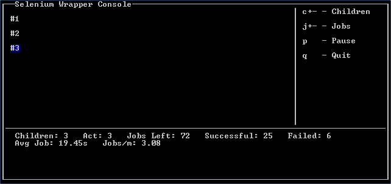

=======
Wrapper
=======

The wrapper can be launched by using ``run.bat`` in Windows or ``python run_test.py`` in Unix-like systems. 
Everything is automatically prepared, so upon launch the first screen is the initial settings wizard.

****************
Initial Settings
****************

.. image:: images/initialsettings.png
   :height: 227 
   :width: 482
   :alt: Initial settings wizard showing several options to be configured.

The initial settings wizard allows configuration and validation of settings before running. Each option has a respective
options directive seen in :ref:`options-directives` including the option to disable the initial settings wizard entirely. 

^^^^^^^^^^^^
Run Settings
^^^^^^^^^^^^

.. code-block:: none

   a) # Children:     1
   b) Stagger Spawn:  False
   c) # Jobs:         1

**# Children**
determines the number of concurrent PhantomJS processes the script will run.
Although the default number is 1, users with a more powerful processor will find themselves capable 
of running over 20, though this varies wildly with the script ran. Scripts with a great deal of waiting on page elements
can run with more concurrent instances than those which are actively clicking or navigating.

**Stagger Spawn**
, which is short for staggered child spawning, is intended to distribute load throughout a site more evenly. 
Without staggering and with a high number of children, the load will be very pinpointed at an exact point
of the site consistently, at least at the beginning. This options spawns children 5 seconds apart by default but can be configured
using :ref:`staggertime <options-directives>`.

**# Jobs**
determines the number of times the recorded script will run. Every child process 
will pull from a job queue (of this length) when it starts and will do so until the queue is empty 

^^^^^^^^^^^^^
Pool Settings
^^^^^^^^^^^^^

.. code-block:: none

   Pool Settings
   d) Log Lvl (0-5):  -1
   e) Get Images:     False

**Log Level (0-5)**
See `Logging`_

**Get Images**
Determines whether PhantomJS will bother to download images. If during recording an image was clicked on, it must either have 
an alt tag for this option to be false.

^^^^^^^^^^^^^^^^^^
Reporting Settings
^^^^^^^^^^^^^^^^^^

.. code-block:: none

  Reporting Settings
  f) Server:         None
  g) Port:           8089
  h) User:           None
  i) Password:       None
  j) Index:          None
  k) Project Name:   None
  l) Run Name:       None
  m) Script Name:    None
  n) Client Name:    auto

**Server, Port, User, Password, Index**
These options are all Splunk installation specific. Splunk must allow remote connections from the client's host on a port, default is 8089
via the `REST API <http://docs.splunk.com/Documentation/Splunk/latest/RESTAPI/RESTcontents>`_. Details about the Splunklib module and how it is used
can be found in :mod:`sw.report` and official documentation `on Splunk's website <http://docs.splunk.com/DocumentationStatic/PythonSDK/1.1/client.html>`_.

**Project Name**
is a layer of abstraction on individual recorded runs with various scripts. It is considered to be the highest level of abstraction to group together these runs, spanning over
days or months. A project would ideally contain a multitude of runs. There are checks done to make sure Project Name is used and valid.

**Run Name**
is a layer of abstraction on individual scripts ran within a period of time, usually expected to be less than a day. Runs may contain one or more scripts to do various load testing.
Run names are checked for valid characters as well.

**Script Name**
is the final layer of abstraction on an individual execution of a script. A script may be unique or may not within a run.

**Client Name**
is usually left on auto. When autogenerated it takes the format ``user@computername``.

*****
Usage
*****

The Selenium Wrapper Console is composed of 3 separate sections: children overview, options list, and statistics overview.

^^^^^^^^^^^^^^^^^
Children Overview
^^^^^^^^^^^^^^^^^

Each child is assigned a unique index (#1, #2, #3 here). This index is printed and changes color depending on the status of the child process.

+--------------------------------------------------+----------+------------+-----------------------------------------+
| Example                                          | Font     | Background | Meaning                                 |
+==================================================+==========+============+=========================================+
| .. image:: images/child_running.png              | White    | Black      | Running                                 |
+--------------------------------------------------+----------+------------+-----------------------------------------+
| .. image:: images/child_waiting.png              | White    | Blue       | Waiting                                 |
+--------------------------------------------------+----------+------------+-----------------------------------------+
| .. image:: images/child_job.png                  | Black    | Green      | Job Finished                            |
+--------------------------------------------------+----------+------------+-----------------------------------------+
| .. image:: images/child_loading.png              | Black    | Yellow     | Loading Subprocess                      |
+--------------------------------------------------+----------+------------+-----------------------------------------+
| .. image:: images/child_error.png                | Black    | Red        | Fatal Error (see log)                   |
+--------------------------------------------------+----------+------------+-----------------------------------------+
| .. image:: images/child_done.png                 | Black    | White      | No Jobs Remaining (child killed)        |
+--------------------------------------------------+----------+------------+-----------------------------------------+

The statistics section is the simplest section,
showing number of children, active number of children (``act``), remaining jobs, successful jobs, failed jobs, average job time, and jobs per minute or per second depending on time taken.

  

*******
Logging
*******

Logging is automatically performed and there is currently not an option to turn it off. All logs
are within a timestamped folder in ``logs/``. Each child then create its own log in in that subfolder with the format
``logs/<timestamp>/log-#.log``, where the number is the child's number printed to the console. This 
log will contain detailed information about errors, time taken, and the status of the script.

Logging levels can be configured with the :ref:`level <options-directives>` directive or within the initial settings wizard. 
Possible levels are as follows: 

There are several levels as seen in ``conversion_files/includes/libs/sw/const.py``:

.. literalinclude:: sw/const.py
   :lines: 38-49 
   :language: python

With the lowest log level, ``INFO``, this is an example of a log that is prepared:

.. code-block:: none

  [15:37:14] (NOTICE)   Child process started and loaded
  [15:37:20] (NOTICE)   Beginning wait for element "accounts" of type "link_text".
  [15:37:35] (NOTICE)   Beginning wait for element "OrderPage_Row_6" of type "name".
  [15:37:42] (NOTICE)   Beginning wait for element "clear_overlay" of type "id".
  [15:37:46] (NOTICE)   In waitToDisappear "clear_overlay" was never there to begin with.
  [15:37:46] (INFO)     Waiting for "clear_overlay"
  [15:37:49] (INFO)     Element "clear_overlay" disappeared!
  [15:37:50] (NOTICE)   Beginning wait for element "clear_overlay" of type "id".
  [15:37:54] (NOTICE)   In waitToDisappear "clear_overlay" was never there to begin with.
  [15:37:57] (NOTICE)   Beginning wait for element "AmountPage_Row_27" of type "name".
  [15:38:02] (INFO)     Waiting for "clear_overlay"
  [15:38:04] (INFO)     Element "clear_overlay" disappeared!
  [15:38:05] (NOTICE)   Beginning wait for element "clear_overlay" of type "id".
  [15:38:08] (NOTICE)   In waitToDisappear "clear_overlay" was never there to begin with.
  [15:38:08] (INFO)     Waiting for "clear_overlay"
  [15:38:10] (INFO)     Element "clear_overlay" disappeared!
  [15:38:10] (INFO)     Waiting for "clear_overlay"
  [15:38:13] (INFO)     Element "clear_overlay" disappeared!
  [15:38:13] (NOTICE)   Beginning wait for element "clear_overlay" of type "id".
  [15:38:16] (NOTICE)   In waitToDisappear "clear_overlay" was never there to begin with.
  [15:38:17] (INFO)     Waiting for "clear_overlay"
  [15:38:19] (INFO)     Element "clear_overlay" disappeared!
  [15:38:19] (INFO)     Waiting for "clear_overlay"
  [15:38:21] (INFO)     Element "clear_overlay" disappeared!
  [15:38:22] (NOTICE)   Beginning wait for element "clear_overlay" of type "id".
  [15:38:25] (NOTICE)   In waitToDisappear "clear_overlay" was never there to begin with.
  [15:38:25] (INFO)     Waiting for "clear_overlay"
  [15:38:27] (INFO)     Element "clear_overlay" disappeared!
  ===================== <More Waiting>
  [15:39:18] (INFO)     Waiting for "clear_overlay"
  [15:39:25] (INFO)     Element "clear_overlay" disappeared!
  [15:39:36] (NOTICE)   Successfully finished job (141.878000021s)
  [15:39:36] (NOTICE)   Stopping child process: "DONE"

On the lowest log level, the wrapper gives a great deal of information about where it is waiting
for debugging purposes. Waits are only documented if they are engaged; if an element can already
be selected, no time is wasted waiting and the script directly interacts with it. The timestamp 
on the far left is the exact time in which the message was printed, the next field is the log level
that this was printed at--- if ``child.level`` were greater than this, it wouldn't print. The final
field is the message itself.

Also placed within the log directory are any screenshots that were taken either as a directive 
within the script or for an error. Any time a screenshot is created, it is noted in the respective
child's log file where it was stored and at what time. For example, here is a log where an error was
encountered:

.. code-block:: none 
  :emphasize-lines: 6 
  
  [14:15:48] (NOTICE)   Child process started and loaded
  [14:15:52] (NOTICE)   Beginning wait for element "Accounts" of type "link_text".
  [14:15:57] (NOTICE)   Choosing grower #16
  [15:37:57] (NOTICE)   Beginning wait for element "AmountPage_Row_27" of type "name".
  [14:16:07] (ERROR)    'sleepwait() takes exactly 3 arguments (4 given)'
  [14:16:08] (ERROR)    Wrote screenshot to: /home/test/script_converter/out/test_script/logs/2014-08-26_14-15-45/error_0.png
  [14:16:08] (ERROR)    Stack trace: Traceback (most recent call last):
    File "/home/test/script_converter/out/test_script/includes/libs/sw/child.py", line 144, in think
      func( self.driver )
    File "/home/test/script_converter/out/test_script/run_test.py", line 30, in test_func
      waitToDisappear( driver, 'AmountPage_Row_27' )
    File "/home/test/script_converter/out/test_script/includes/libs/sw/utils.py", line 212, in waitToDisappear
      sleepwait( driver, element, type, kwargs )
    TypeError: sleepwait() takes exactly 3 arguments (4 given)
  [14:16:08] (NOTICE)   Stopping child process: "RESTARTING"  

The highlighted line shows where the screenshot was written to, ``error_#.png``. Every new error increments this number.
 
